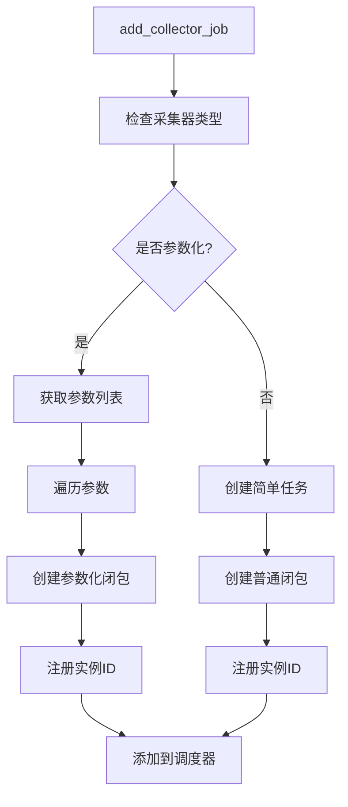
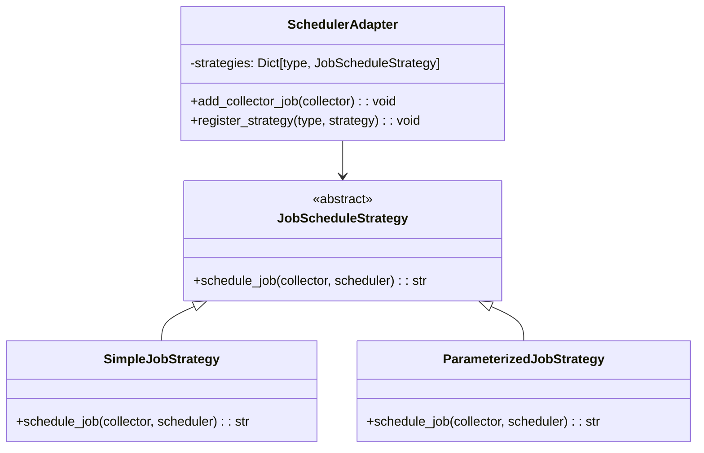
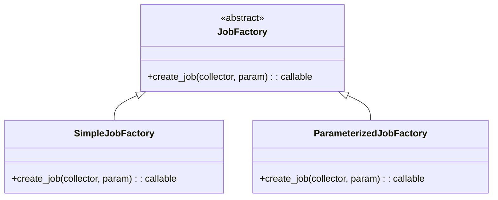
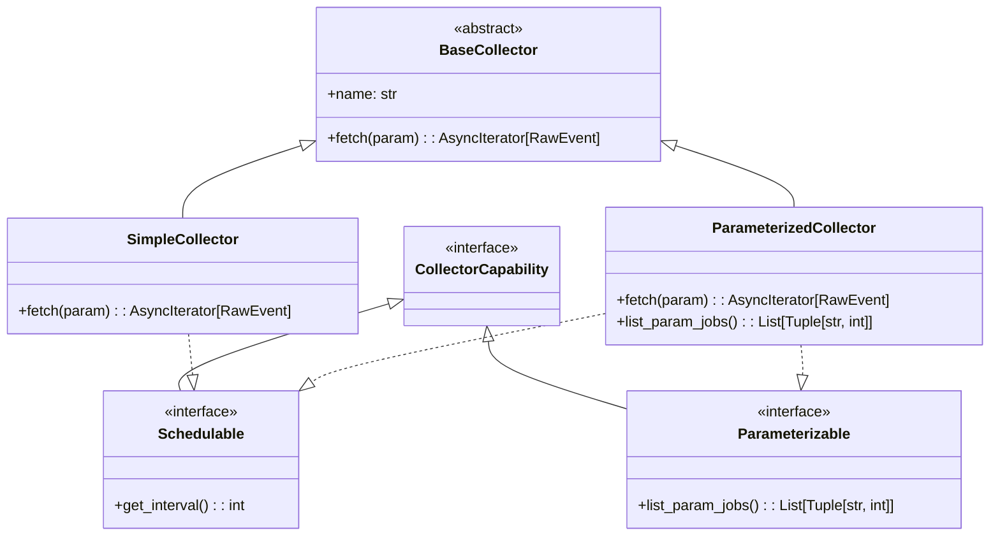
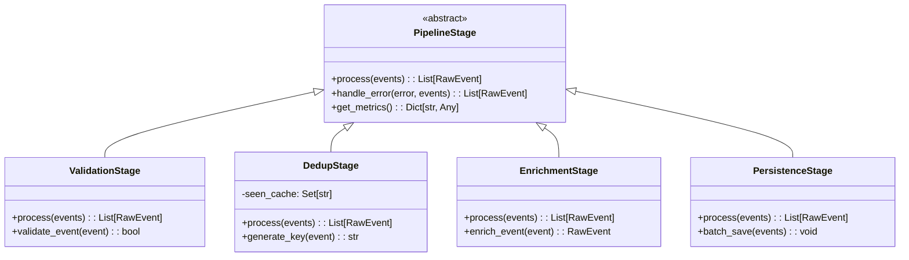
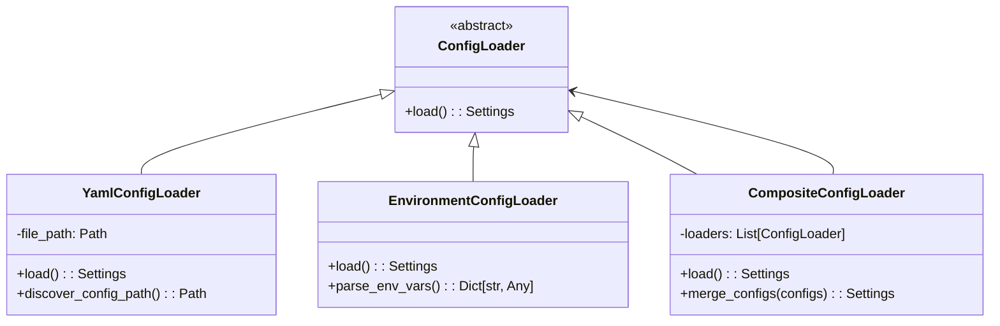
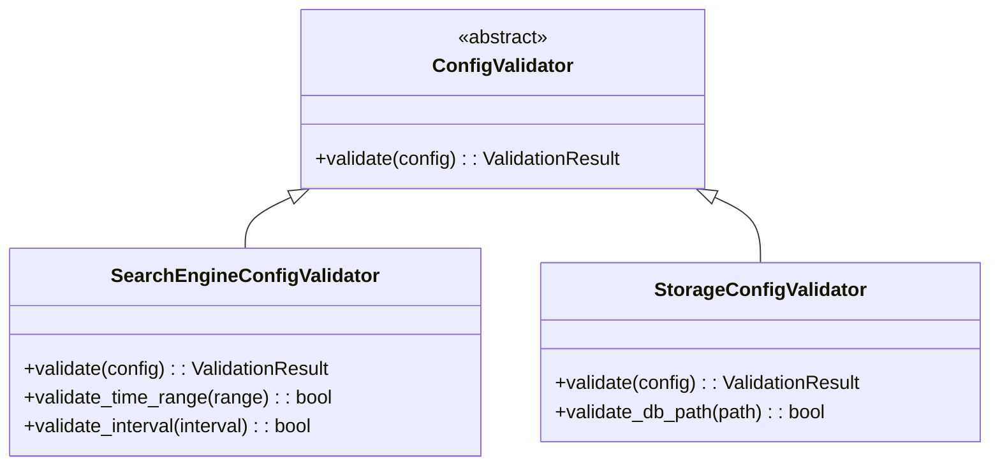
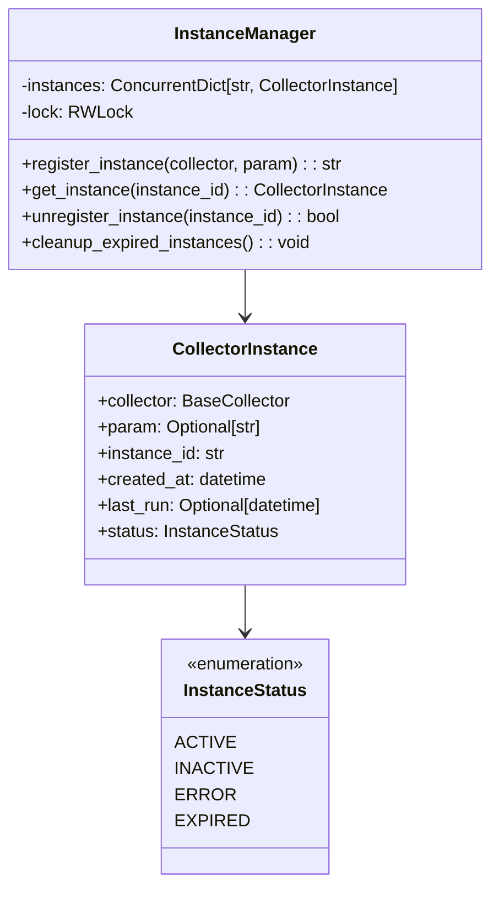

# RayInfo 2025 代码重构优化设计文档

## 概述

基于对 RayInfo 2025 项目的深入代码分析，本文档识别了系统中实现复杂、可读性差的代码模块，并提出了相应的重构优化方案。重构目标是在保持功能完整性的前提下，简化代码实现，提升代码可读性和维护性。

## 技术栈

- **后端框架**: FastAPI + APScheduler + Playwright
- **数据库**: SQLite with SQLAlchemy ORM
- **编程语言**: Python 3.11+
- **调度系统**: AsyncIOScheduler (APScheduler)

## 主要问题识别

### 1. 调度器职责过重 (SchedulerAdapter)

**问题描述**:
- `add_collector_job` 方法包含复杂的条件分支处理
- 参数化和非参数化采集器逻辑耦合在同一方法中
- 闭包创建逻辑复杂，难以理解和测试

**复杂度分析**:

### 2. 采集器抽象层次不清晰

**问题描述**:
- BaseCollector、SimpleCollector、ParameterizedCollector 层次关系复杂
- 运行时类型检查过多，违反开闭原则
- 参数处理逻辑分散在多个地方

### 3. 管道阶段处理缺乏统一性

**问题描述**:
- PipelineStage 基类过于简单，缺乏统一的错误处理机制
- SqlitePersistStage 包含过多职责（数据转换、存储、错误处理）
- 去重逻辑使用列表实现，性能较差

### 4. 配置管理复杂性

**问题描述**:
- Settings 类的 from_yaml 方法包含复杂的兼容性处理
- 配置路径发现逻辑复杂，容错性不足
- 配置验证逻辑分散

### 5. 实例ID管理器设计过于简单

**问题描述**:
- InstanceIDManager 缺乏并发安全性考虑
- ID 冲突处理机制缺失
- 实例生命周期管理不完善

## 重构优化方案

### 1. 调度器模块重构

#### 1.1 策略模式重构任务调度

**优化要点**:
- 将不同类型采集器的调度逻辑分离到独立策略类
- 消除 `add_collector_job` 中的复杂条件分支
- 提升代码可测试性和扩展性

#### 1.2 任务工厂模式

### 2. 采集器架构简化

#### 2.1 采集器能力接口

**优化要点**:
- 通过接口明确采集器能力
- 减少运行时类型检查
- 提升类型安全性

### 3. 管道处理优化

#### 3.1 责任链模式增强

#### 3.2 去重算法优化

**当前实现问题**:
- 使用列表查找，时间复杂度 O(n)
- 内存使用不可控

**优化方案**:
- 使用 Set 进行 O(1) 查找
- 实现 LRU 缓存机制
- 支持持久化去重状态

### 4. 配置管理重构

#### 4.1 配置加载器分离

#### 4.2 配置验证器

### 5. 实例管理器增强

#### 5.1 线程安全的实例管理

## 实现计划

### 阶段一：核心模块重构
1. **调度器策略模式重构** (优先级：高)
   - 实现 JobScheduleStrategy 抽象类
   - 创建 SimpleJobStrategy 和 ParameterizedJobStrategy
   - 重构 SchedulerAdapter.add_collector_job 方法

2. **管道处理优化** (优先级：高)
   - 增强 PipelineStage 基类
   - 优化 DedupStage 去重算法
   - 重构 SqlitePersistStage

### 阶段二：架构层面优化
1. **采集器能力接口设计** (优先级：中)
   - 定义 Parameterizable 和 Schedulable 接口
   - 重构现有采集器类继承关系

2. **配置管理重构** (优先级：中)
   - 实现配置加载器模式
   - 添加配置验证机制

### 阶段三：系统性改进
1. **实例管理器增强** (优先级：低)
   - 添加线程安全机制
   - 实现实例生命周期管理

2. **监控和诊断** (优先级：低)
   - 添加性能指标收集
   - 实现调试和诊断工具

## 性能优化目标

### 内存使用优化
- 去重缓存从 O(n) 列表查找优化为 O(1) 集合查找
- 实现 LRU 缓存避免内存无限增长
- 预期内存使用降低 30-50%

### 代码可读性提升
- 消除深层嵌套的条件分支
- 单一职责原则应用到所有核心类
- 方法复杂度降低到 15 行以内

### 扩展性改进
- 新增采集器类型无需修改调度器核心逻辑
- 管道阶段可插拔设计
- 配置扩展无需修改验证逻辑

## 测试策略

### 单元测试覆盖
- 所有重构模块达到 90% 以上代码覆盖率
- 重点测试策略模式的正确性
- 管道处理的边界条件测试

### 集成测试验证
- 端到端数据采集流程验证
- 调度器在高并发场景下的稳定性
- 配置热加载机制测试

### 性能回归测试
- 建立性能基准测试套件
- 监控内存使用和CPU占用
- 确保重构后性能不降级

## 风险评估

### 技术风险
- **兼容性风险**: 现有配置文件格式需要保持向后兼容
- **数据一致性风险**: 去重逻辑变更可能影响数据重复率
- **并发安全风险**: 实例管理器改造需要充分测试并发场景

### 缓解措施
1. **渐进式重构**: 分模块进行重构，确保每个阶段功能完整
2. **特性开关**: 使用配置开关控制新功能启用
3. **回滚机制**: 保留原有实现作为备选方案
4. **充分测试**: 建立全面的自动化测试套件

## 成功指标

### 代码质量指标
- 圈复杂度平均降低 40%
- 代码重复率降低到 5% 以下
- 单个方法行数控制在 20 行以内

### 维护性指标
- 新增采集器开发时间减少 50%
- 配置错误调试时间减少 60%
- 代码评审效率提升 30%

### 性能指标
- 内存使用优化 30-50%
- 调度器响应时间提升 20%
- 数据处理吞吐量提升 15%