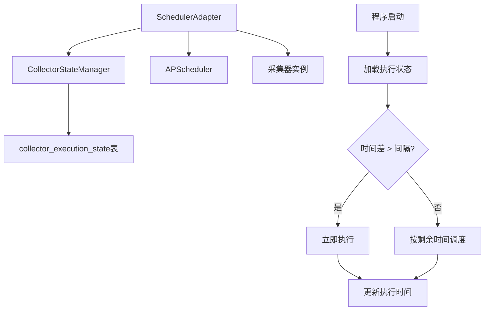
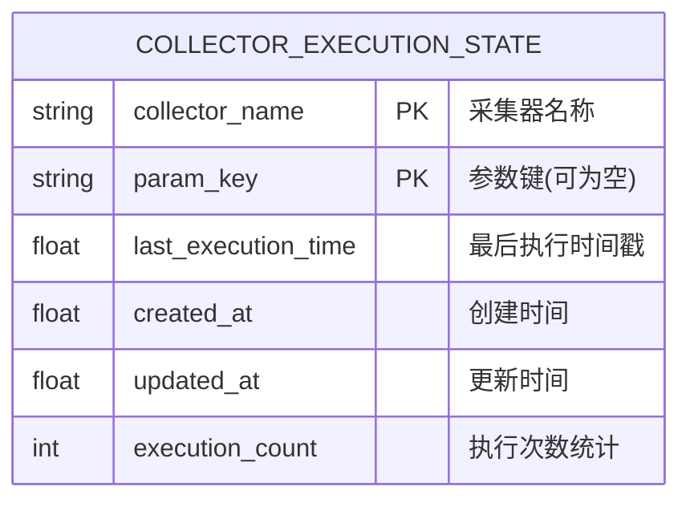
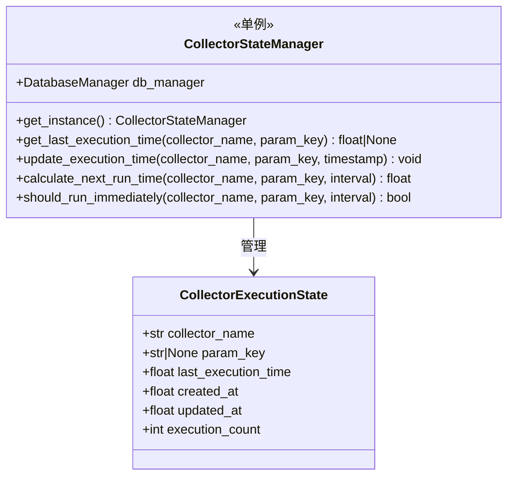
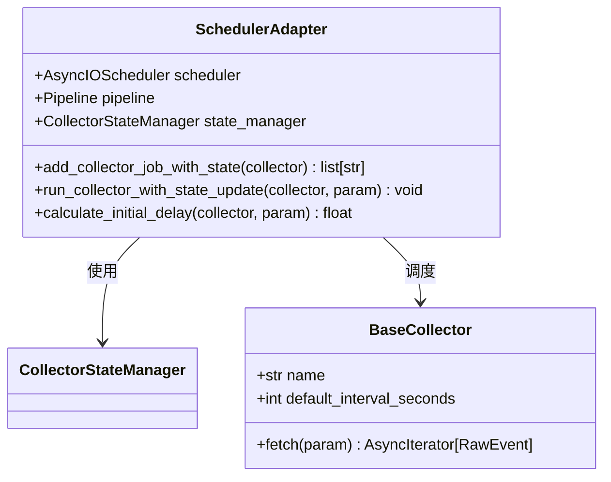
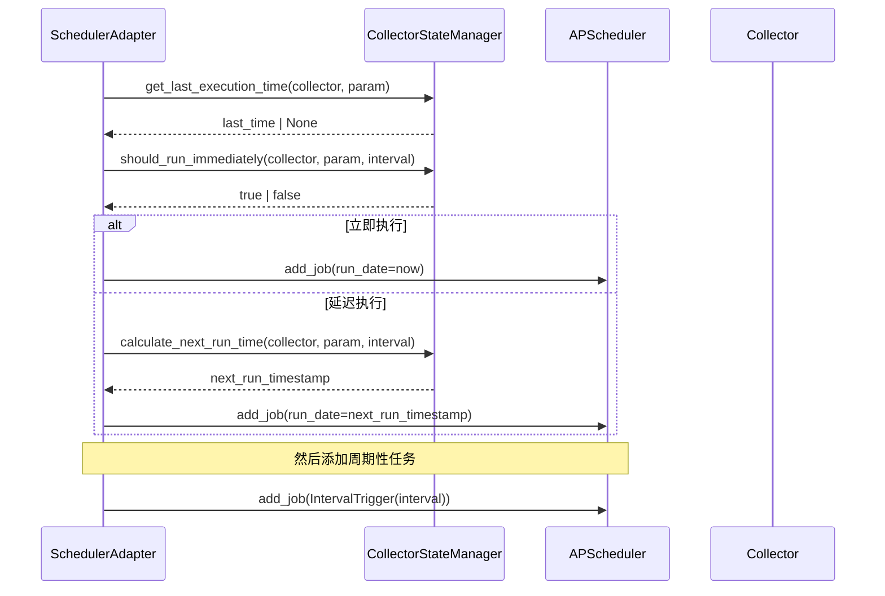
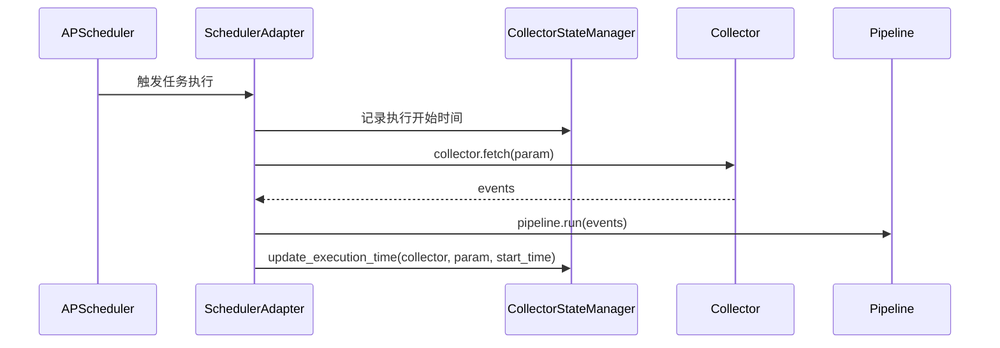

# 采集器时间持久化功能设计

## 概述

本文档设计一个采集器时间持久化功能，实现类似"断点续传"的机制。系统会将每个采集器的最后执行时间保存到数据库，程序重启时自动加载并根据时间差智能调度采集任务。

### 核心需求

1. **时间持久化**: 保存每个采集器实例的最后执行时间戳到数据库
2. **断点续传**: 程序启动时自动加载上次执行时间
3. **智能调度**: 根据时间差决定立即执行或正常调度
4. **参数化支持**: 支持普通采集器和参数化采集器两种模式

### 业务规则

- 如果当前时间与上次执行时间的差值 > 1个调度间隔，立即执行一次采集
- 否则，按照剩余时间进行正常调度
- 首次运行的采集器立即执行一次

## 架构设计

### 系统架构图



### 数据模型设计

#### 采集器执行状态表



**字段说明**:
- `collector_name`: 采集器名称，如 "weibo.home"
- `param_key`: 参数化采集器的参数键，普通采集器为 NULL
- `last_execution_time`: Unix时间戳，记录最后一次执行时间
- `execution_count`: 执行次数，用于统计和调试

### 核心组件设计

#### CollectorStateManager (采集器状态管理器)



#### 增强的调度器适配器



## 详细实现规范

### 数据库表结构

```sql
CREATE TABLE collector_execution_state (
    collector_name TEXT NOT NULL,
    param_key TEXT,
    last_execution_time REAL NOT NULL,
    created_at REAL NOT NULL DEFAULT (strftime('%s', 'now')),
    updated_at REAL NOT NULL DEFAULT (strftime('%s', 'now')),
    execution_count INTEGER NOT NULL DEFAULT 0,
    PRIMARY KEY (collector_name, param_key)
);

-- 索引优化查询性能
CREATE INDEX idx_collector_execution_time ON collector_execution_state(collector_name, last_execution_time);
```

### CollectorStateManager 实现规范

#### 状态查询方法

```python
def get_last_execution_time(self, collector_name: str, param_key: str = None) -> float | None:
    """获取采集器最后执行时间
    
    Args:
        collector_name: 采集器名称
        param_key: 参数键，普通采集器传入None
        
    Returns:
        最后执行时间戳，首次运行返回None
    """
```

#### 时间更新方法

```python
def update_execution_time(self, collector_name: str, param_key: str = None, 
                         timestamp: float = None) -> None:
    """更新采集器执行时间
    
    使用UPSERT操作确保幂等性，自动处理首次插入和后续更新。
    同时更新execution_count计数器。
    """
```

#### 智能调度判断

```python
def should_run_immediately(self, collector_name: str, param_key: str = None, 
                          interval_seconds: int) -> bool:
    """判断是否应该立即执行
    
    业务逻辑：
    1. 首次运行 -> 立即执行
    2. 时间差 > 间隔 -> 立即执行  
    3. 否则 -> 正常调度
    """

def calculate_next_run_time(self, collector_name: str, param_key: str = None,
                           interval_seconds: int) -> float:
    """计算下次运行时间
    
    返回绝对时间戳，用于APScheduler的run_date参数
    """
```

### 调度器集成方案

#### 修改后的任务添加流程



#### 任务执行时的状态更新



### 配置扩展

#### 新增配置选项

```yaml
# rayinfo.yaml 新增状态管理配置
storage:
  db_path: "./data/rayinfo.db"
  batch_size: 100
  enable_wal: true
  # 新增：状态管理配置
  state_management:
    enable_time_persistence: true    # 是否启用时间持久化
    cleanup_old_states: true         # 是否清理旧状态记录
    state_retention_days: 30         # 状态记录保留天数
```

## 实现时序

### 阶段1: 数据模型和状态管理器

1. 创建 `CollectorExecutionState` 数据模型
2. 实现 `CollectorStateManager` 单例类
3. 添加数据库表创建和迁移逻辑

### 阶段2: 调度器集成

1. 修改 `SchedulerAdapter.add_collector_job()` 方法
2. 实现状态感知的任务调度逻辑
3. 添加执行时间更新机制

### 阶段3: 配置和优化

1. 扩展配置文件支持状态管理选项
2. 添加状态清理和维护功能
3. 完善日志记录和错误处理

## 测试策略

### 单元测试

1. **CollectorStateManager测试**
   - 状态CRUD操作测试
   - 时间计算逻辑测试
   - 并发安全性测试

2. **调度逻辑测试**
   - 首次运行立即执行测试
   - 超时立即执行测试
   - 正常延迟调度测试

### 集成测试

1. **端到端流程测试**
   - 程序启动状态加载测试
   - 采集器执行状态更新测试
   - 重启后断点续传测试

2. **数据一致性测试**
   - 多采集器并发执行测试
   - 参数化采集器状态隔离测试
   - 异常情况数据恢复测试

## 性能考量

### 数据库优化

1. **索引策略**: 在 `(collector_name, param_key)` 上建立复合主键索引
2. **批量操作**: 状态更新使用事务批量提交
3. **连接复用**: 复用现有的DatabaseManager单例

### 内存优化

1. **状态缓存**: CollectorStateManager可添加LRU缓存减少数据库查询
2. **延迟加载**: 只在需要时加载采集器状态
3. **清理机制**: 定期清理过期的状态记录

### 调度优化

1. **任务分散**: 避免所有采集器同时启动造成系统负载峰值
2. **错误隔离**: 单个采集器状态异常不影响其他采集器调度
3. **重试机制**: 状态更新失败时的指数退避重试

## 监控与可观测性

### 关键指标

1. **执行统计**: 每个采集器的执行次数和频率
2. **时间偏差**: 实际执行时间与计划时间的偏差
3. **状态异常**: 状态更新失败次数和原因

### 日志记录

```python
# 关键日志记录点
logger.info("采集器状态加载完成", collector=name, last_time=timestamp, action="load")
logger.info("采集器立即执行", collector=name, reason="first_run|timeout", delay=0)
logger.info("采集器延迟执行", collector=name, delay_seconds=delay, next_run=next_time)
logger.info("状态更新完成", collector=name, execution_count=count)
```

### 错误处理

1. **状态读取失败**: 降级为首次运行模式，记录警告日志
2. **状态更新失败**: 重试机制，不影响采集任务正常执行  
3. **时间计算异常**: 使用默认调度策略，记录错误详情