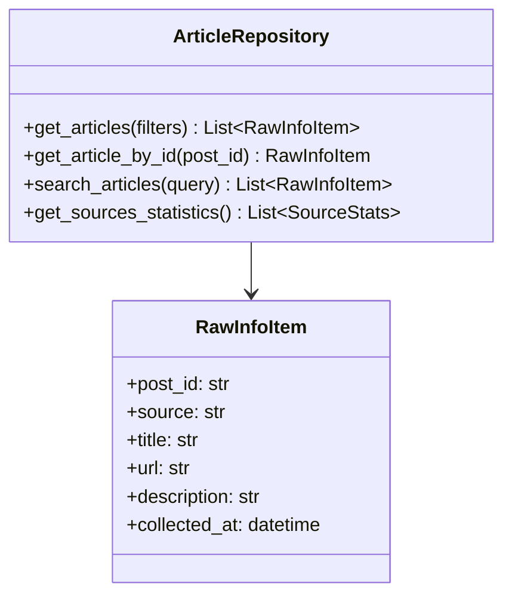
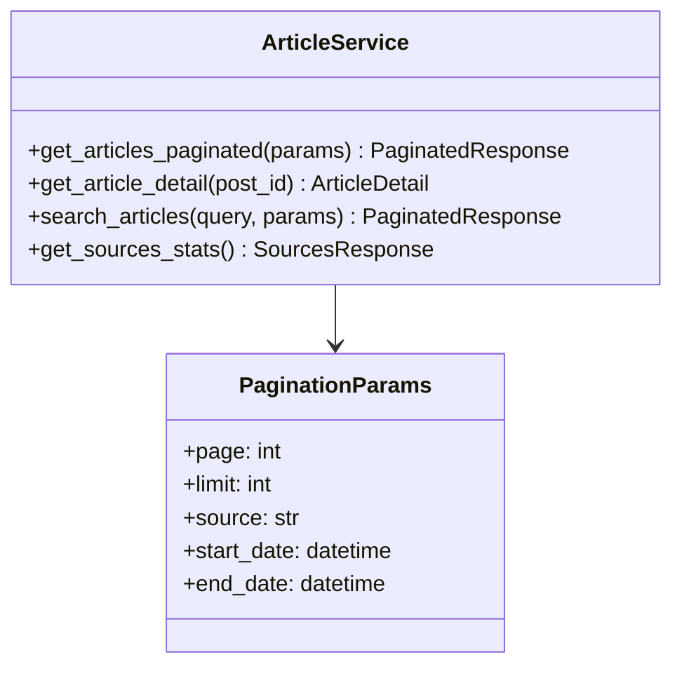
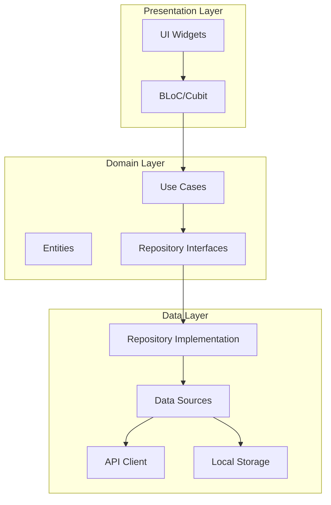
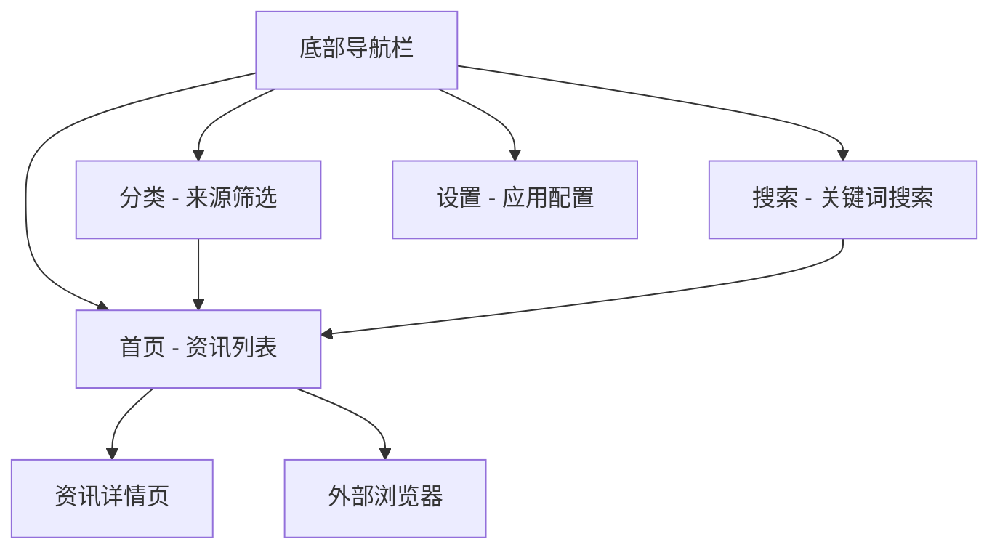
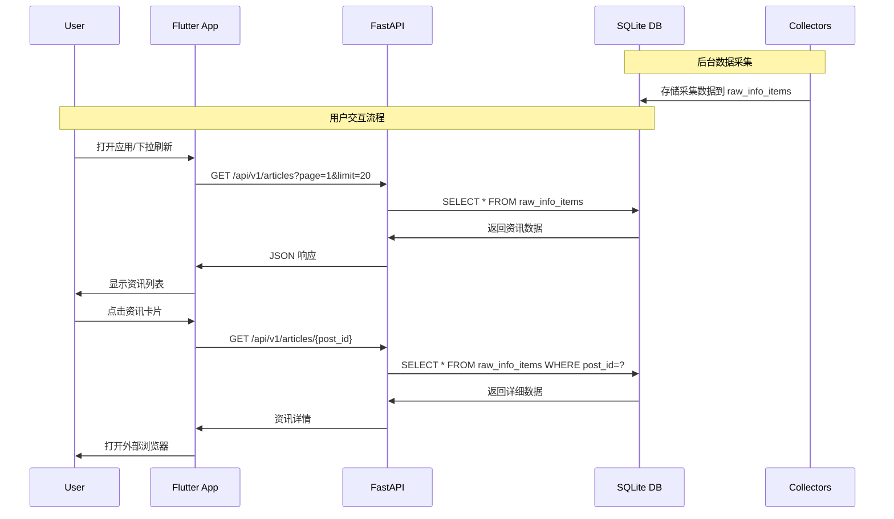
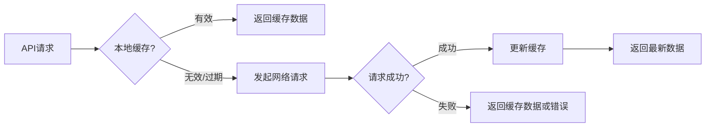

# RayInfo 跨平台阅读器开发设计文档

## 概述

基于现有的 RayInfo 后端信息聚合系统，开发一个跨平台的 Flutter 前端应用，用作资讯阅读器。该应用将从 rayinfo_backend 获取采集到的信息并以类似 RSS 阅读器的形式展示给用户，实现对抗算法投喂、夺回注意力主权的目标。

### 核心目标
- 为 rayinfo_backend 提供完整的 REST API 接口
- 开发 Flutter 跨平台移动应用作为前端界面
- 实现资讯的浏览、筛选、搜索等核心功能
- 完成前后端接口联调和数据交互

### 技术栈
- **后端**: Python FastAPI + SQLAlchemy + SQLite
- **前端**: Flutter 3.9+ + Dart
- **数据库**: SQLite (现有)
- **通信协议**: HTTP REST API

## 后端 API 架构设计

### API 接口规范

#### 1. 资讯获取接口

```http
GET /api/v1/articles
```

**查询参数:**
- `page`: 页码 (default: 1)
- `limit`: 每页条数 (default: 20, max: 100)
- `source`: 来源筛选 (可选: mes.search, weibo.home, etc.)
- `query`: 关键词搜索 (可选)
- `start_date`: 开始日期 (可选, ISO 8601 格式)
- `end_date`: 结束日期 (可选, ISO 8601 格式)

**响应格式:**
```json
{
  "data": [
    {
      "post_id": "string",
      "source": "string",
      "title": "string",
      "url": "string",
      "description": "string",
      "query": "string",
      "engine": "string",
      "collected_at": "2025-01-XX:XX:XX.XXXZ",
      "processed": 1
    }
  ],
  "pagination": {
    "current_page": 1,
    "total_pages": 10,
    "total_items": 200,
    "per_page": 20,
    "has_next": true,
    "has_prev": false
  }
}
```

#### 2. 资讯详情接口

```http
GET /api/v1/articles/{post_id}
```

**响应格式:**
```json
{
  "post_id": "string",
  "source": "string", 
  "title": "string",
  "url": "string",
  "description": "string",
  "query": "string",
  "engine": "string",
  "raw_data": {},
  "collected_at": "2025-01-XX:XX:XX.XXXZ",
  "processed": 1
}
```

#### 3. 来源统计接口

```http
GET /api/v1/sources
```

**响应格式:**
```json
{
  "sources": [
    {
      "name": "mes.search",
      "display_name": "搜索引擎",
      "count": 150,
      "latest_update": "2025-01-XX:XX:XX.XXXZ"
    }
  ]
}
```

#### 4. 搜索接口

```http
GET /api/v1/search
```

**查询参数:**
- `q`: 搜索关键词 (必需)
- `page`: 页码 (default: 1)
- `limit`: 每页条数 (default: 20)

### API 实现架构

#### 数据访问层 (Repository Pattern)


#### 服务层 (Service Layer)


#### API 路由层
```mermaid
graph TB
    A[FastAPI App] --> B[/api/v1/articles Router]
    B --> C[ArticleController]
    C --> D[ArticleService]
    D --> E[ArticleRepository]
    E --> F[SQLAlchemy Session]
    F --> G[SQLite Database]
```

## 前端 Flutter 架构设计

### 应用架构模式

采用 **Clean Architecture** 结合 **BLoC Pattern** 实现状态管理和业务逻辑分离。



### 核心模块设计

#### 1. 数据模型 (Domain Entities)

```dart
// lib/domain/entities/article.dart
class Article {
  final String postId;
  final String source;
  final String title;
  final String url;
  final String? description;
  final String? query;
  final String? engine;
  final DateTime collectedAt;
  final int processed;
}

// lib/domain/entities/source.dart
class Source {
  final String name;
  final String displayName;
  final int count;
  final DateTime? latestUpdate;
}

// lib/domain/entities/pagination.dart
class Pagination {
  final int currentPage;
  final int totalPages;
  final int totalItems;
  final int perPage;
  final bool hasNext;
  final bool hasPrev;
}
```

#### 2. 用例层 (Use Cases)

```dart
// lib/domain/usecases/get_articles.dart
class GetArticlesUseCase {
  final ArticleRepository repository;
  
  Future<PaginatedResult<Article>> call(ArticleFilters filters);
}

// lib/domain/usecases/search_articles.dart
class SearchArticlesUseCase {
  final ArticleRepository repository;
  
  Future<PaginatedResult<Article>> call(String query, int page);
}

// lib/domain/usecases/get_sources.dart
class GetSourcesUseCase {
  final ArticleRepository repository;
  
  Future<List<Source>> call();
}
```

#### 3. 状态管理 (BLoC)

```dart
// lib/presentation/bloc/articles/articles_bloc.dart
class ArticlesBloc extends Bloc<ArticlesEvent, ArticlesState> {
  final GetArticlesUseCase getArticlesUseCase;
  final SearchArticlesUseCase searchArticlesUseCase;
  
  // 状态：Loading, Loaded, Error
  // 事件：LoadArticles, SearchArticles, RefreshArticles
}

// lib/presentation/bloc/sources/sources_bloc.dart  
class SourcesBloc extends Bloc<SourcesEvent, SourcesState> {
  final GetSourcesUseCase getSourcesUseCase;
}
```

### UI 界面设计

#### 1. 应用导航结构



#### 2. 核心页面组件

**首页资讯列表 (HomeScreen)**
```dart
// lib/presentation/screens/home/home_screen.dart
class HomeScreen extends StatelessWidget {
  // 包含：
  // - AppBar with 搜索按钮
  // - RefreshIndicator 下拉刷新
  // - ListView.builder 无限滚动
  // - ArticleCard 资讯卡片组件
  // - FloatingActionButton 回到顶部
}
```

**资讯卡片组件 (ArticleCard)**
```dart  
// lib/presentation/widgets/article_card.dart
class ArticleCard extends StatelessWidget {
  // 布局：
  // - 标题 (最多2行，超出省略)
  // - 来源标签 + 时间
  // - 描述预览 (最多3行)
  // - 操作按钮 (分享、收藏等)
}
```

**筛选面板 (FilterBottomSheet)**
```dart
// lib/presentation/widgets/filter_bottom_sheet.dart
class FilterBottomSheet extends StatefulWidget {
  // 功能：
  // - 来源多选
  // - 日期范围选择
  // - 排序方式选择
}
```

#### 3. 主题设计

```dart
// lib/core/theme/app_theme.dart
class AppTheme {
  static ThemeData lightTheme = ThemeData(
    // 主色调: 深蓝 #1E3A8A (阅读友好)
    // 辅助色: 橙色 #F59E0B (突出操作)
    // 背景色: 浅灰 #F8FAFC
    // 卡片色: 纯白 #FFFFFF
  );
  
  static ThemeData darkTheme = ThemeData(
    // 深色模式适配
  );
}
```

### 网络请求架构

#### HTTP 客户端封装

```dart
// lib/data/datasources/api_client.dart
class ApiClient {
  final Dio dio;
  final String baseUrl;
  
  Future<List<Article>> getArticles(ArticleParams params);
  Future<Article> getArticleById(String postId);
  Future<List<Source>> getSources();
  Future<List<Article>> searchArticles(String query, int page);
}

// lib/data/repositories/article_repository_impl.dart
class ArticleRepositoryImpl implements ArticleRepository {
  final ApiClient apiClient;
  final LocalStorage localStorage;
  
  // 实现缓存逻辑、网络错误处理、离线支持
}
```

## 数据流程设计

### 完整的数据流转过程



### 缓存策略



## 技术实现规划

### 后端开发任务

#### 1. API 接口实现
- [ ] 创建 API 路由模块 (`/api/v1/` 前缀)
- [ ] 实现 ArticleRepository 数据访问层
- [ ] 实现 ArticleService 业务逻辑层
- [ ] 添加分页、筛选、搜索功能
- [ ] 集成 CORS 中间件支持跨域
- [ ] 添加 API 文档 (Swagger/OpenAPI)

#### 2. 数据库优化
- [ ] 为 `raw_info_items` 表添加必要索引
- [ ] 实现软删除机制 (避免显示重复/无效内容)
- [ ] 添加全文搜索支持 (SQLite FTS)

#### 3. 性能优化
- [ ] 实现查询结果缓存
- [ ] 添加 API 限流保护
- [ ] 优化数据库查询性能

### 前端开发任务

#### 1. 项目初始化
- [ ] 配置 Flutter 项目依赖 (dio, bloc, get_it, etc.)
- [ ] 设置项目架构目录结构
- [ ] 配置代码生成工具 (json_serializable)

#### 2. 核心功能开发
- [ ] 实现数据模型和 JSON 序列化
- [ ] 开发 HTTP 客户端和 Repository
- [ ] 实现 BLoC 状态管理
- [ ] 开发主要 UI 页面和组件
- [ ] 实现筛选、搜索、分页功能

#### 3. 用户体验优化
- [ ] 添加加载状态和错误处理
- [ ] 实现下拉刷新和无限滚动
- [ ] 添加离线缓存支持
- [ ] 优化启动速度和内存使用

### 联调测试

#### 1. 接口联调
- [ ] 测试所有 API 端点的正确性
- [ ] 验证数据格式和字段完整性
- [ ] 测试分页、筛选、搜索功能
- [ ] 处理网络异常和边界情况

#### 2. 集成测试
- [ ] 端到端功能测试
- [ ] 性能测试 (大量数据场景)
- [ ] 多平台兼容性测试 (Android/iOS)
- [ ] 网络环境适应性测试

### 部署配置

#### 后端部署
- [ ] 配置生产环境 FastAPI 服务
- [ ] 设置 Nginx 反向代理
- [ ] 配置 HTTPS 证书
- [ ] 设置 API 监控和日志

#### 前端发布
- [ ] 配置 Android/iOS 构建环境
- [ ] 生成签名证书和配置
- [ ] 准备应用商店发布资料
- [ ] 设置应用更新机制

## 关键技术决策

### 1. API 设计原则
- **RESTful 风格**: 使用标准 HTTP 方法和状态码
- **版本控制**: `/api/v1/` 前缀支持 API 演进
- **分页策略**: 基于页码的分页 (简单易用)
- **错误处理**: 统一错误响应格式

### 2. 前端架构选择
- **状态管理**: BLoC Pattern (适合复杂状态逻辑)
- **依赖注入**: GetIt (轻量级服务定位器)
- **网络请求**: Dio (功能丰富的HTTP客户端)
- **本地存储**: Hive (高性能NoSQL数据库)

### 3. 性能优化策略
- **后端缓存**: 查询结果内存缓存 (降低数据库压力)
- **前端缓存**: 分层缓存 (内存 + 本地存储)
- **懒加载**: 图片和长列表优化
- **预加载**: 下一页数据预取

### 4. 用户体验设计
- **响应式布局**: 适配不同屏幕尺寸
- **主题支持**: 明暗双主题
- **无障碍性**: 语义化标签和辅助功能
- **国际化**: 中英文双语支持

这个设计为 RayInfo 项目提供了一个完整的前后端开发方案，通过清晰的架构设计和详细的实现规划，确保能够构建出一个高质量的跨平台资讯阅读应用。