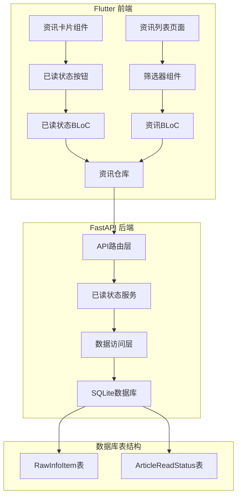
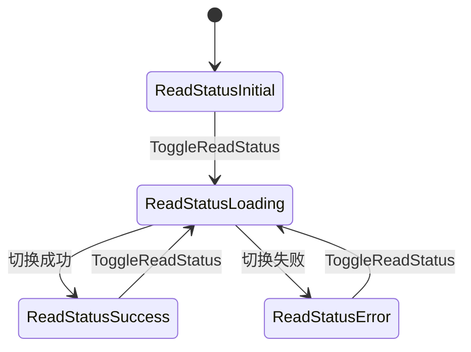
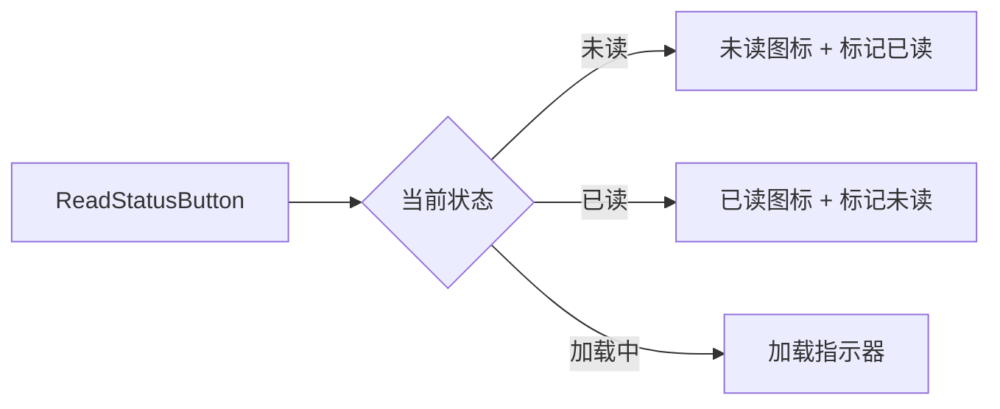
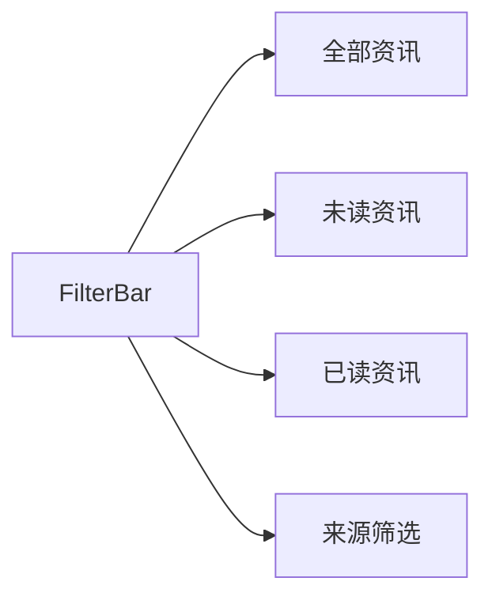
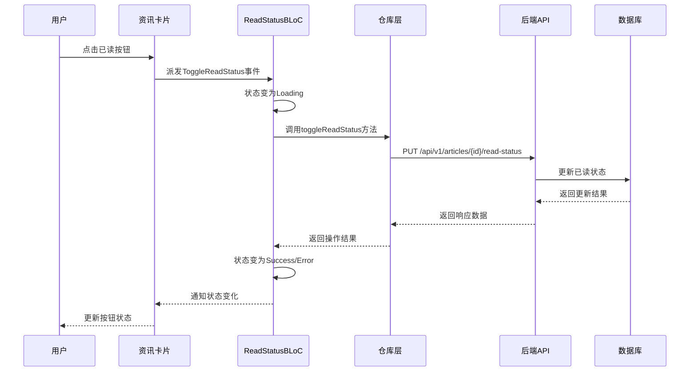
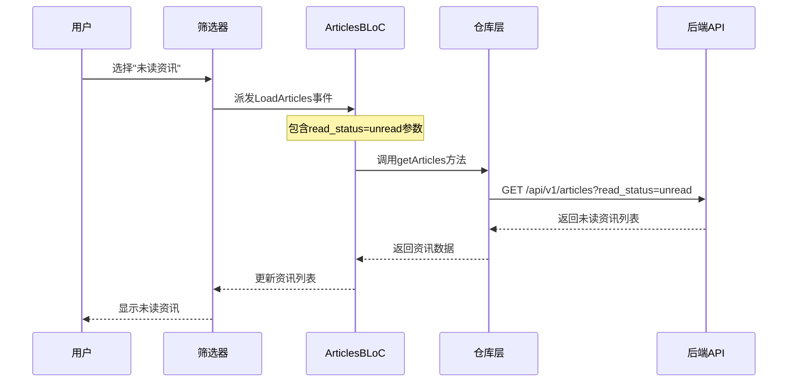
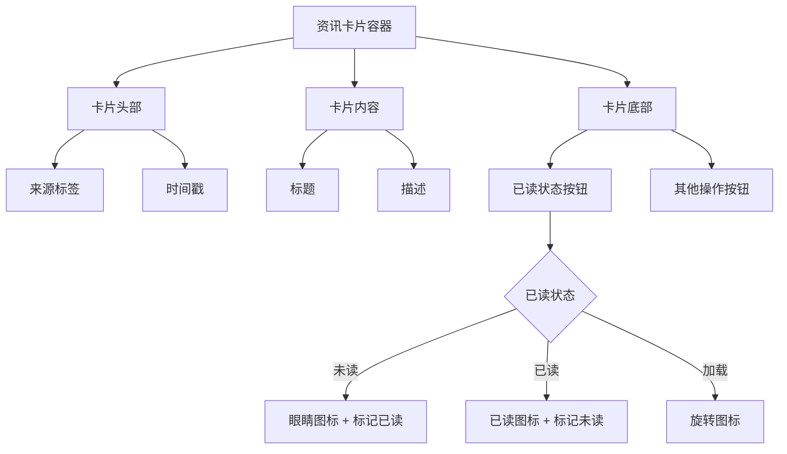
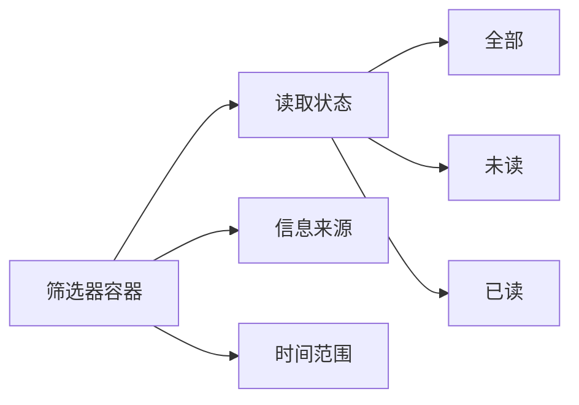

# 资讯已读状态切换功能设计

## 概述

本设计实现 RayInfo 应用中的资讯已读状态管理功能。用户可以通过手动点击按钮标记资讯为已读/未读状态，并支持在资讯列表中筛选未读资讯，从而提升用户的信息管理体验。

## 技术架构

### 系统组件架构



## 数据库设计

### 新增表结构

#### ArticleReadStatus 表
```sql
CREATE TABLE article_read_status (
    post_id VARCHAR NOT NULL PRIMARY KEY,
    is_read BOOLEAN NOT NULL DEFAULT FALSE,
    read_at TIMESTAMP NULL,
    updated_at TIMESTAMP NOT NULL DEFAULT CURRENT_TIMESTAMP,
    FOREIGN KEY (post_id) REFERENCES raw_info_items(post_id) ON DELETE CASCADE
);

CREATE INDEX idx_article_read_status_is_read ON article_read_status(is_read);
CREATE INDEX idx_article_read_status_read_at ON article_read_status(read_at);
```

### 数据模型定义

#### SQLAlchemy 模型
```python
class ArticleReadStatus(Base):
    __tablename__ = "article_read_status"
    
    post_id = Column(String, ForeignKey("raw_info_items.post_id"), primary_key=True)
    is_read = Column(Boolean, nullable=False, default=False, index=True)
    read_at = Column(DateTime, nullable=True, index=True)
    updated_at = Column(DateTime, nullable=False, default=datetime.utcnow)
```

## 后端 API 设计

### API 端点

#### 1. 切换已读状态
```http
PUT /api/v1/articles/{post_id}/read-status
Content-Type: application/json

{
    "is_read": true
}
```

**响应格式：**
```json
{
    "success": true,
    "data": {
        "post_id": "article_123",
        "is_read": true,
        "read_at": "2025-01-27T10:30:00Z",
        "updated_at": "2025-01-27T10:30:00Z"
    }
}
```

#### 2. 批量设置已读状态
```http
PUT /api/v1/articles/batch-read-status
Content-Type: application/json

{
    "post_ids": ["article_123", "article_456"],
    "is_read": true
}
```

#### 3. 获取资讯列表（支持已读筛选）
```http
GET /api/v1/articles?read_status=unread&page=1&limit=20
```

**参数说明：**
- `read_status`: 可选值 `read`, `unread`, `all`（默认）

### Pydantic 数据模型

```python
# 请求模型
class ReadStatusRequest(BaseModel):
    is_read: bool

class BatchReadStatusRequest(BaseModel):
    post_ids: List[str]
    is_read: bool

# 响应模型
class ReadStatusResponse(BaseModel):
    post_id: str
    is_read: bool
    read_at: Optional[datetime]
    updated_at: datetime

class ArticleWithReadStatus(BaseModel):
    post_id: str
    source: str
    title: Optional[str]
    url: Optional[str]
    description: Optional[str]
    collected_at: datetime
    is_read: bool
    read_at: Optional[datetime]
```

## 前端 Flutter 设计

### 状态管理架构

#### ReadStatus BLoC



#### BLoC 事件定义
```dart
abstract class ReadStatusEvent extends Equatable {}

class ToggleReadStatus extends ReadStatusEvent {
  final String postId;
  final bool isRead;
  
  ToggleReadStatus({required this.postId, required this.isRead});
}

class BatchToggleReadStatus extends ReadStatusEvent {
  final List<String> postIds;
  final bool isRead;
  
  BatchToggleReadStatus({required this.postIds, required this.isRead});
}
```

#### BLoC 状态定义
```dart
abstract class ReadStatusState extends Equatable {}

class ReadStatusInitial extends ReadStatusState {}

class ReadStatusLoading extends ReadStatusState {
  final String? postId;
  ReadStatusLoading({this.postId});
}

class ReadStatusSuccess extends ReadStatusState {
  final String postId;
  final bool isRead;
  
  ReadStatusSuccess({required this.postId, required this.isRead});
}

class ReadStatusError extends ReadStatusState {
  final String message;
  ReadStatusError(this.message);
}
```

### 组件设计

#### 已读状态按钮组件


#### 筛选器组件


### 实体模型扩展

#### Article 实体扩展
```dart
class Article extends Equatable {
  // 现有字段...
  final bool isRead;
  final DateTime? readAt;
  
  const Article({
    // 现有参数...
    required this.isRead,
    this.readAt,
  });
  
  // 创建副本方法
  Article copyWith({
    bool? isRead,
    DateTime? readAt,
  }) {
    return Article(
      // 现有字段复制...
      isRead: isRead ?? this.isRead,
      readAt: readAt ?? this.readAt,
    );
  }
}
```

## 用户交互流程

### 标记已读流程



### 筛选未读资讯流程



## 业务逻辑实现

### 后端服务层

#### ReadStatusService 类
```python
class ReadStatusService:
    def __init__(self, db_manager: DatabaseManager):
        self.db_manager = db_manager
    
    def toggle_read_status(self, post_id: str, is_read: bool) -> ReadStatusResponse:
        """切换单篇资讯的已读状态"""
        
    def batch_toggle_read_status(self, post_ids: List[str], is_read: bool) -> BatchReadStatusResponse:
        """批量设置已读状态"""
        
    def get_read_status(self, post_id: str) -> Optional[ReadStatusResponse]:
        """获取资讯已读状态"""
```

### 前端仓库层

#### ArticleRepository 扩展
```dart
abstract class ArticleRepository {
  // 现有方法...
  
  Future<ReadStatusResult> toggleReadStatus(String postId, bool isRead);
  Future<BatchReadStatusResult> batchToggleReadStatus(List<String> postIds, bool isRead);
  Future<PaginatedArticles> getArticles({
    int page = 1,
    int limit = 20,
    String? source,
    String? query,
    ReadStatusFilter? readStatus,
  });
}

enum ReadStatusFilter { all, read, unread }
```

## 用户界面设计

### 资讯卡片布局



### 筛选器界面



## 错误处理策略

### 网络错误处理
- 连接超时：显示重试提示
- 服务器错误：显示友好错误信息
- 网络断开：缓存操作，网络恢复后同步

### 数据一致性保障
- 乐观更新：立即更新UI，失败时回滚
- 本地缓存：临时存储操作记录
- 冲突解决：以服务器数据为准

### 用户体验优化
- 防抖动：避免快速点击导致重复请求
- 加载状态：提供视觉反馈
- 错误恢复：提供重试机制

## 性能优化考虑

### 数据库层面
- 索引优化：在 `is_read` 和 `read_at` 字段建立索引
- 查询优化：使用 JOIN 查询减少 N+1 问题
- 分页策略：支持基于游标的分页

### 前端缓存策略
- 状态缓存：BLoC状态持久化
- 列表缓存：避免重复请求
- 增量更新：仅更新变化的项目

## 测试策略

### 单元测试覆盖
- BLoC 状态管理测试
- 仓库层 API 交互测试
- 服务层业务逻辑测试
- 数据模型序列化测试

### 集成测试重点
- 前后端 API 对接测试
- 数据库操作测试
- 用户交互流程测试

### 用户体验测试
- 响应时间测试
- 离线场景测试
- 错误恢复测试