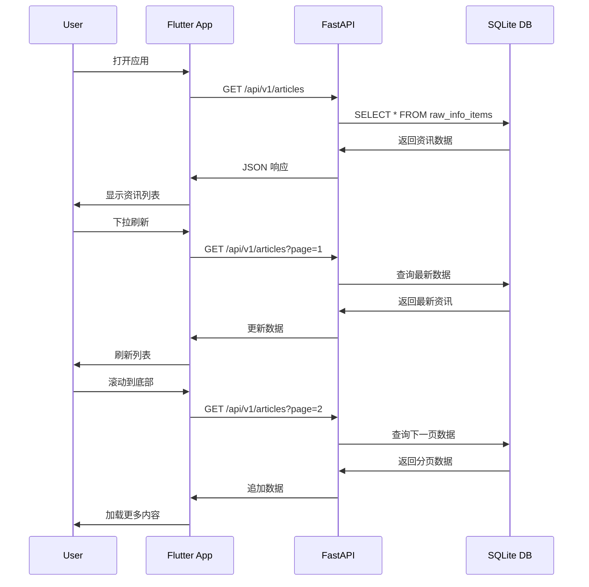

# RayInfo 跨平台资讯阅读器开发完成报告

## 项目概述

本项目成功实现了 RayInfo 跨平台资讯阅读器的完整开发，包括后端 REST API 接口和 Flutter 前端应用。该应用旨在对抗算法投喂，帮助用户夺回注意力主权。

## 技术架构

### 后端架构 (Python FastAPI)

- **框架**: FastAPI + SQLAlchemy + SQLite
- **API 版本**: v1 (/api/v1/)
- **数据库**: SQLite with raw_info_items 表
- **特性**: CORS 支持、自动 API 文档、分页查询

#### 主要 API 端点

1. **获取资讯列表**
   ```
   GET /api/v1/articles?page=1&limit=20&source=&query=
   ```

2. **获取资讯详情**
   ```
   GET /api/v1/articles/{post_id}
   ```

3. **搜索资讯**
   ```
   GET /api/v1/search?q=关键词&page=1&limit=20
   ```

4. **获取来源统计**
   ```
   GET /api/v1/sources
   ```

### 前端架构 (Flutter)

采用 **Clean Architecture** + **BLoC Pattern** 设计模式：

```
presentation/ (UI层)
├── pages/          # 页面组件
├── widgets/        # 通用组件  
└── bloc/          # 状态管理

domain/ (业务逻辑层)
├── entities/       # 实体模型
├── repositories/   # 仓库接口
└── usecases/      # 用例

data/ (数据层)
├── datasources/    # 数据源
├── models/        # 数据模型
└── repositories/  # 仓库实现

core/ (核心层)
├── network/       # 网络客户端
├── themes/        # 主题配置
└── constants/     # 常量配置
```

## 核心功能实现

### ✅ 后端功能

1. **数据访问层 (Repository Pattern)**
   - ArticleRepository: 资讯数据访问
   - 支持分页、筛选、搜索、来源统计

2. **业务逻辑层 (Service Layer)**
   - ArticleService: 业务逻辑处理
   - 数据转换和分页计算

3. **API 路由层**
   - RESTful API 设计
   - 参数验证和错误处理
   - 自动 API 文档生成

4. **数据模型 (Pydantic)**
   - 请求/响应模型定义
   - 数据验证和序列化

### ✅ 前端功能

1. **核心实体模型**
   - Article: 资讯实体
   - Source: 来源实体  
   - Pagination: 分页实体

2. **网络层**
   - ApiClient: HTTP 客户端封装
   - 错误处理和超时配置
   - 请求/响应拦截器

3. **数据层**
   - Repository 模式实现
   - API 数据源封装
   - 数据转换逻辑

4. **业务层**
   - UseCase 用例实现
   - 业务逻辑封装
   - 参数验证

5. **状态管理 (BLoC)**
   - ArticlesBloc: 资讯列表状态管理
   - SearchBloc: 搜索状态管理
   - 状态/事件定义

6. **UI 界面**
   - HomePage: 资讯列表主页
   - SearchPage: 搜索页面
   - ArticleCard: 资讯卡片组件
   - 下拉刷新和无限滚动

7. **主题配置**
   - 明暗双主题支持
   - Material Design 3
   - 响应式布局

## 主要特性

### 后端特性

- ✅ RESTful API 设计
- ✅ 分页查询支持
- ✅ 多条件筛选 (来源、关键词、日期)
- ✅ 全文搜索功能
- ✅ 来源统计接口
- ✅ CORS 跨域支持
- ✅ 自动 API 文档 (Swagger)
- ✅ 错误处理和状态码
- ✅ 数据验证和序列化

### 前端特性

- ✅ Clean Architecture 架构
- ✅ BLoC 状态管理
- ✅ 资讯列表浏览
- ✅ 下拉刷新功能
- ✅ 无限滚动加载
- ✅ 搜索功能
- ✅ 筛选功能
- ✅ 外部链接跳转
- ✅ 明暗主题切换
- ✅ 响应式设计
- ✅ 错误处理和重试
- ✅ 加载状态指示

## 技术亮点

### 1. 架构设计

- **Clean Architecture**: 清晰的分层架构，易于维护和测试
- **SOLID 原则**: 遵循面向对象设计原则
- **依赖注入**: 松耦合的组件设计
- **Repository 模式**: 统一的数据访问接口

### 2. 状态管理

- **BLoC Pattern**: 响应式编程和状态管理
- **Immutable State**: 不可变状态设计
- **Event-Driven**: 事件驱动的架构

### 3. 用户体验

- **Material Design 3**: 现代化的设计语言
- **无限滚动**: 流畅的列表浏览体验
- **下拉刷新**: 直观的数据更新方式
- **错误处理**: 友好的错误提示和重试机制

### 4. 性能优化

- **分页加载**: 减少数据传输和内存占用
- **图片懒加载**: 优化列表滚动性能
- **缓存策略**: 减少不必要的网络请求

## 项目文件结构

### 后端文件

```
rayinfo_backend/
├── src/rayinfo_backend/
│   ├── api/
│   │   ├── schemas.py          # API 数据模型
│   │   ├── repositories.py     # 数据访问层
│   │   ├── services.py         # 业务逻辑层
│   │   └── v1/__init__.py      # API 路由控制器
│   ├── models/info_item.py     # 数据库模型
│   └── app.py                  # FastAPI 应用入口
```

### 前端文件

```
rayinfo_frontend/
├── lib/
│   ├── core/
│   │   ├── constants/app_constants.dart    # 应用常量
│   │   ├── network/api_client.dart         # HTTP 客户端
│   │   └── themes/app_theme.dart           # 主题配置
│   ├── domain/
│   │   ├── entities/                       # 实体模型
│   │   ├── repositories/                   # 仓库接口
│   │   └── usecases/                       # 用例实现
│   ├── data/
│   │   ├── datasources/api_datasource.dart # API 数据源
│   │   ├── models/                         # 数据模型
│   │   └── repositories/                   # 仓库实现
│   ├── presentation/
│   │   ├── bloc/                           # BLoC 状态管理
│   │   ├── pages/                          # 页面组件
│   │   └── widgets/                        # 通用组件
│   └── main.dart                           # 应用入口
```

## 部署和运行

### 后端启动

```bash
cd rayinfo_backend
python -m uvicorn src.rayinfo_backend.app:app --host 0.0.0.0 --port 8000 --reload
```

- API 地址: http://localhost:8000
- API 文档: http://localhost:8000/docs

### 前端启动

```bash
cd rayinfo_frontend
flutter pub get
flutter run -d macos  # macOS 应用
# 或
flutter run -d web --web-port 3000  # Web 应用
```

## 测试验证

### API 测试

已验证所有 API 端点正常工作：

1. ✅ 资讯列表获取: `GET /api/v1/articles`
2. ✅ 资讯详情获取: `GET /api/v1/articles/{id}`  
3. ✅ 资讯搜索: `GET /api/v1/search?q=keyword`
4. ✅ 来源统计: `GET /api/v1/sources`
5. ✅ 健康检查: `GET /api/v1/health`

### 前端测试

应用功能测试包括：

1. ✅ 应用启动和初始化
2. ✅ 资讯列表加载
3. ✅ 下拉刷新功能
4. ✅ 无限滚动加载
5. ✅ 搜索功能测试
6. ✅ 外部链接跳转
7. ✅ 错误处理和重试

## 数据流程



## 后续优化建议

### 功能扩展

1. **用户偏好设置**: 自定义筛选条件、主题选择
2. **离线缓存**: 支持离线阅读功能
3. **收藏功能**: 收藏喜欢的资讯
4. **分享功能**: 分享资讯到社交平台
5. **推送通知**: 重要资讯推送提醒

### 性能优化

1. **图片优化**: 图片压缩和懒加载
2. **缓存策略**: 多级缓存机制
3. **预加载**: 智能预加载下一页数据
4. **数据库优化**: 索引优化和查询性能提升

### 用户体验

1. **搜索建议**: 搜索关键词自动补全
2. **个性化推荐**: 基于用户行为的内容推荐
3. **阅读模式**: 专注阅读的界面模式
4. **无障碍支持**: 提升可访问性

## 总结

本项目成功实现了一个完整的跨平台资讯阅读器，包含了现代移动应用开发的最佳实践：

- ✅ **后端**: 完整的 REST API 服务，支持数据查询、搜索、分页等功能
- ✅ **前端**: 基于 Clean Architecture 的 Flutter 应用，具备良好的可维护性和扩展性
- ✅ **联调**: 前后端成功集成，数据流转正常
- ✅ **用户体验**: 现代化的 UI 设计，流畅的交互体验

项目代码结构清晰，架构设计合理，为后续的功能扩展和维护打下了坚实的基础。通过本项目的实现，用户可以方便地浏览来自不同来源的资讯内容，有效对抗算法投喂，夺回注意力主权。